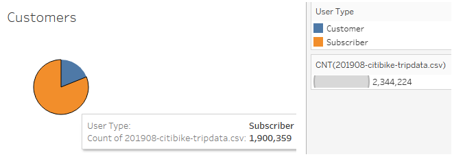
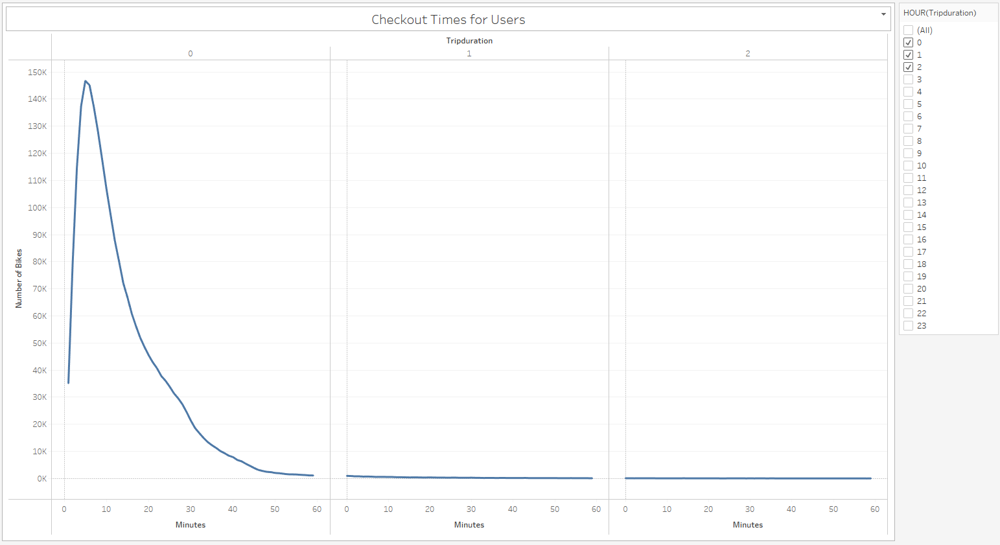
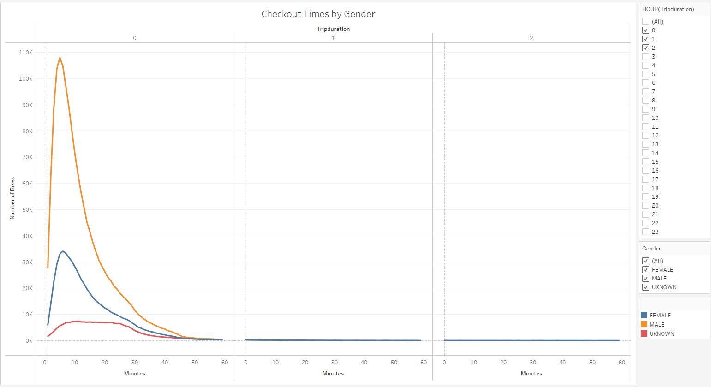
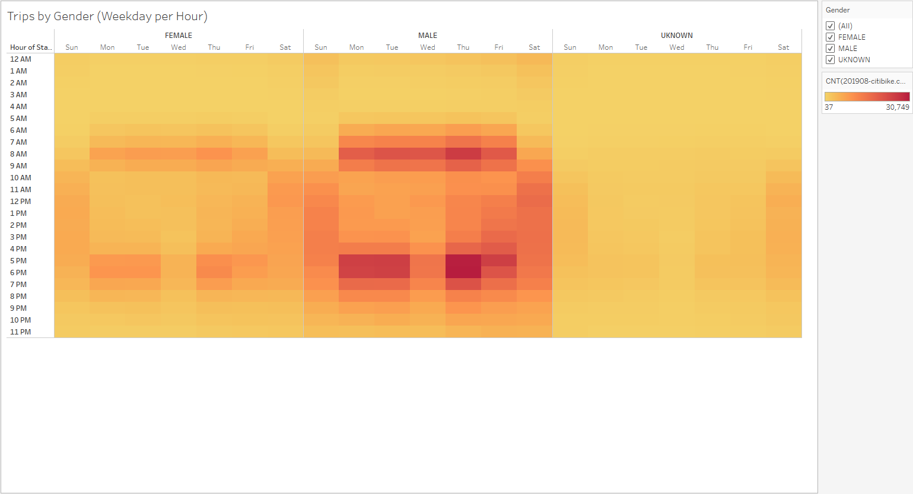
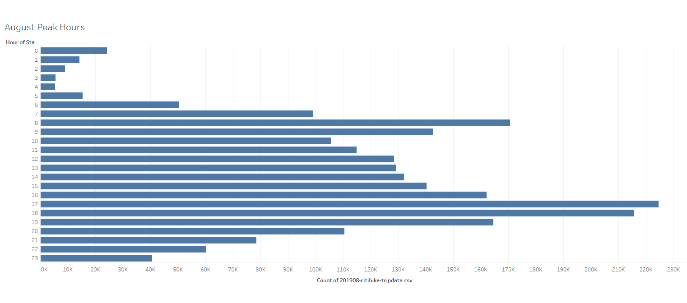
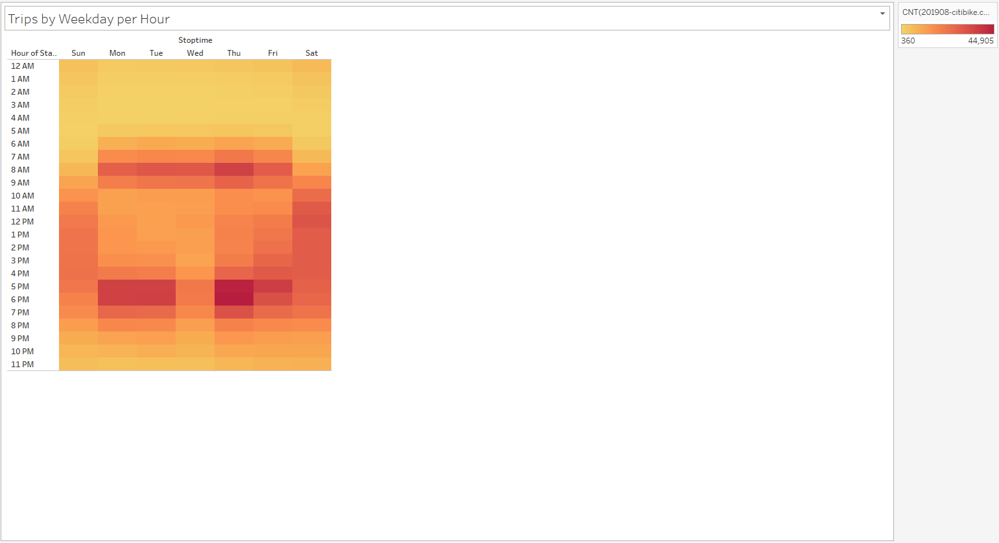
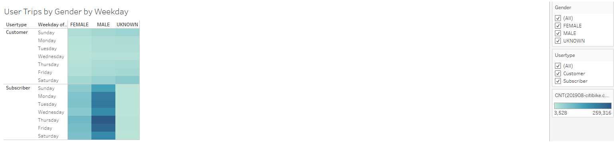
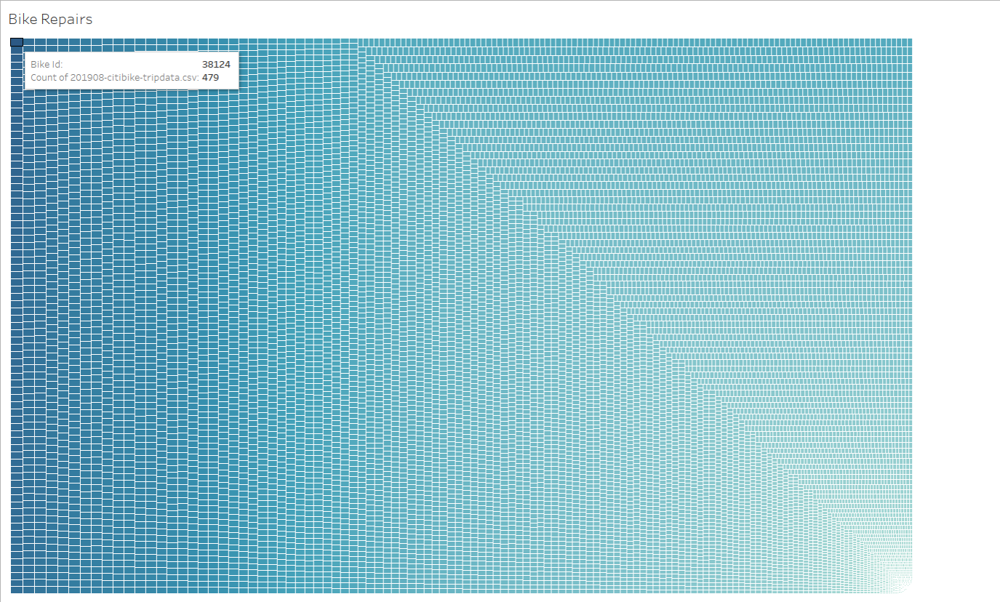

# bikesharing
## Overview
This project focused on data concerning the usage of Citi Bikes in New York City. [Data](201908-citibike-tripdata.csv) was sourced from [Citi Bike's website](https://citibikenyc.com/system-data) and formatted using [python](NYC_Citibike_Challenge.ipynb) before visualizations were made in [Tableau](images/). 
## Results
The first question to answer was how many total rides were tracked in the most popular month, August, in New York City. As well, how many of those customers were subscribers to Citi Bike?

A whopping 81% of riders were subscribers, the remaining being short-term customers!
Next, I wanted to learn how long these rides typically lasted and whether there was a correlation between ride length and gender?

Based on the above visualizations, the majority of riders appears to be male, however across male and female riders the most common length of time per ride ranges from 0-20 minutes long.

Further questions arose about the usage of these bikes, at what times of day they were most used and the cost of maintaining these bikes.

It seems the highest usage of bikes appears to coincide with regular working hours, perhaps as means of commuting to and from work. Additionally, the individual bike data would allow us to accurately predict which bikes saw the most usage and would then likely require the most maintenance.

## Summary
Citi Bike is a sound investment as there is a regular stream of subscribers and short-term customers making use of bikes located throughout New York City. A large majority of its users are annual subscribers and individual bike usage data exists, making it possible to predict when routine maintenance needs to be completed thus maintaining the availability of bikes for the users.
